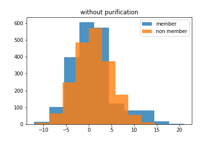
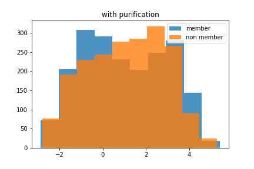
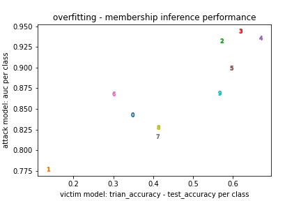
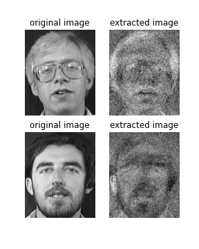
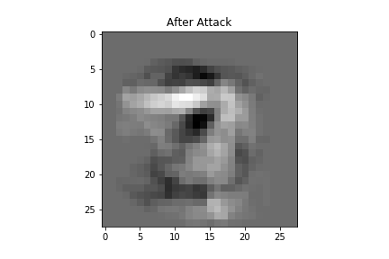

# secure machine learning

## Defense

### 1. DPSGD

DPSGD is a kind of optimization algorythms which gurantee differential privacy.

*M. Abadi, A. Chu, I. Goodfellow, B. McMahan, I. Mironov, K. Talwar, and L. Zhang. Deep learning with differential privacy. In 23rd ACM Conference on Computer and Communications Security(ACM CCS), pp. 308–318, 2016, https://arxiv.org/abs/1607.00133*

        example
                optimizer = DPSGD(torch_model.parameters(), lr=0.01, sigma=0.3, c=0.15)

### 2. purification

Purification is a defense algorythm against membership inference and model inversion attacks.
It may be able to work for other types of attacks. The intuition behind Purificaiton is that
applying autoencoder with prediction made by ml algorythms can decrease the deviation of predicted value which
is one of the biggest causes of vulnerability of machine learning.

results of label 4

|                  | with purifier | without purifier |
| ---------------- | ------------- | ---------------- |
| auc              | 0.64785575    | 0.881917625      |
| std (member)     | 1.9158936     | 4.728585         |
| std (non member) | 1.7840259     | 4.033065         |

*Z. Yang, B. Shao, B. Xuan, E. Chang, F. Zhang, Defending Model Inversion and Membership Inference Attacks via Prediction Purification, 2020, https://arxiv.org/abs/2005.03915*

## Offense

### 1. membership inference

I implemented the membership inference for pytorch and scikit-learn.
My implementation is mainly based on this paper.

 *R. Shokri, M. Stronati, C. Song, V. Shmatikov. Membership inference attacks against machine learning models. 2017 IEEE Symposium on Security and Privacy (SP). IEEE, 2017. https://arxiv.org/abs/1610.05820*

        example

                shadow_models = [Net().to(device),
                                 Net().to(device),
                                 Net().to(device),
                                 Net().to(device),
                                 Net().to(device)]
                shadow_data_size = 2000
                shadow_transform = transform

                num_label = 10
                attack_models = [SVC(probability=True) for i in range(num_label)]

                mi = Membership_Inference(shadow_models, attack_models,
                                        shadow_data_size, shadow_transform)
                # train shadow models
                mi.shadow(X_test, y_test, num_itr=20)
                # train attack model
                mi.attack()

                # preds is the prediction from target (victim) model
                # label is the true label of the data
                pred_in_or_not = mi.predict_proba(preds, label)

I tested my implementation on CIFAR10 and got similar results described in the paper. I sampled 2000 data as training data for the target model, 2000 data as validation data for the target model, and 4000 data for the shadow model. The overall auc of attack model, which predict whether or not the specific data was used for the training of target model, is 0.850.
The figure shows the performance of the target model and attack model. x axis represents the accuracy of target model for training data minus the accuracy of target model for test data. y axis means the auc of attack model. As the paper says, you can see that
overfitting can be the main factor for the success of membership inference.

### 2. model inversion

Model inversion is the methods to exract the training data from the output of the model.
I implemented this method for pytorch model and test it on AT&T Database of Faces described in the paper.
The usage of my implementation is as follows.

        example
                mi = Model_inversion(torch_model, input_shape)
                x_result, log = mi.attack(target_label, step_size, number_of_iterations)

You can see some results on AT&T dataset.

*M. Fredrikson, S. Jha, and T. Ristenpart. Model inversion attacks that exploit confidence information and basic countermeasures. In Proceedings of the 22nd ACM SIGSAC Conference on Computer and Communications Security. ACM, 2015. https://dl.acm.org/doi/pdf/10.1145/2810103.2813677*

### 3. Evasion Attack

The target model is SVM with the RBF kernel which is trained for binary classification
between "3" and "7" of mnist.
The performance of the model is as follows.

                  precision    recall  f1-score   support

               3       0.99      0.99      0.99       229
               7       0.99      0.99      0.99       271

        accuracy                           0.99       500
       macro avg       0.99      0.99      0.99       500
    weighted avg       0.99      0.99      0.99       500

I created an adversarial example which seems "7" for human, but svm can't correctly classify. The result is shown in the following picture.

The usage of my code is really simple.

        example on MNIST

            # datasets which contains only "3"
            X_minus_1 = X_train[np.where(y_train == "3")]

            # Attack_sklearn automatically detect the type of the classifier
            attacker = Attack_sklearn(clf = clf, X_minus_1 = X_minus_1,
                                      dmax =  (5000 / 255) * 2.5,
                                      max_iter = 300,
                                      gamma = 1 / (X_train.shape[1] * np.var(X_train)),
                                      lam = 10, t = 0.5, h = 10)

            # x0 is the intial ponint ("7")
            xm, log = attacker.attack(x0)

*Biggio, B., Corona, I., Maiorca, D., Nelson, B., Šrndić, N., Laskov, P., Giacinto, G., Roli, F., 2013. Evasion Attacks against Machine Learning at Test Time. In ECML-PKDD 2013. https://arxiv.org/abs/1708.06131*

### 4. Poisoning Attack

Second, I implemented a "poisoning attack" against SVM with a linear kernel.
The data set is the same as section 1, and I referred to the following paper.
You can see that adding only one poisoned image dramatically decreases the accuracy of SVM.

The usage of my code is as follows.

        example

            attacker = Poison_attack_sklearn(clf,
                                            X_train_, y_train_,
                                            t=0.5)

            xc_attacked, log = attacker.attack(xc, 1,
                                            X_valid, y_valid_,
                                            num_iterations=200)

*Biggio, B., Nelson, B. and Laskov, P., 2012. Poisoning attacks against support vector machines. In ICML 2012. https://arxiv.org/abs/1206.6389*